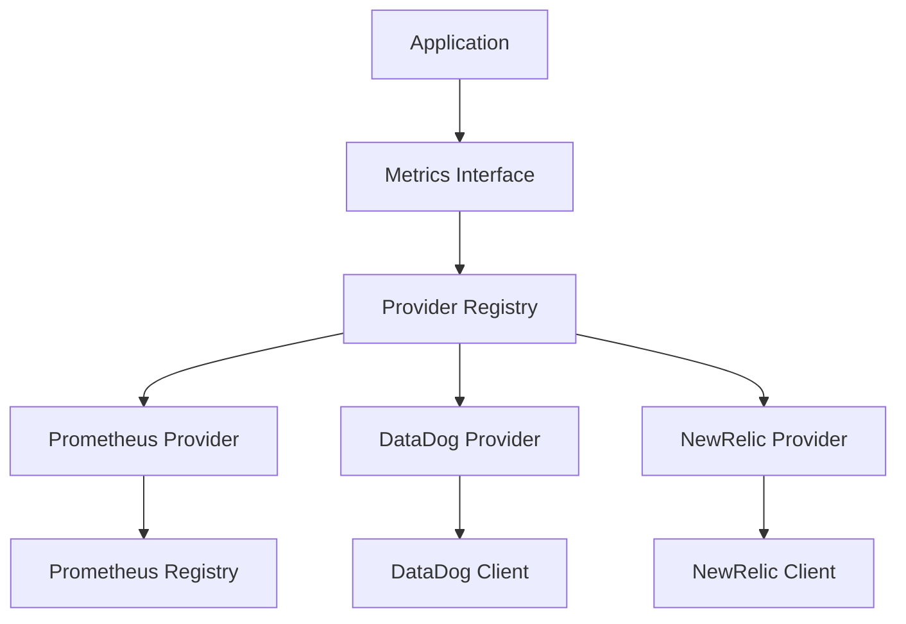

# Nexs-Lib Metrics Module

[](https://pkg.go.dev/github.com/fsvxavier/nexs-lib/observability/metrics)
[](https://goreportcard.com/report/github.com/fsvxavier/nexs-lib)

Uma biblioteca de métricas moderna, extensível e provider-agnóstica para aplicações Go com suporte nativo para Prometheus, DataDog e NewRelic.

## Visão Geral

O módulo de métricas da Nexs-Lib oferece uma interface unificada para coleta, processamento e envio de métricas para diferentes sistemas de monitoramento. Projetado para alta performance e facilidade de uso, oferece abstrações consistentes independente do provider utilizado.

## 🚀 Características Principais

- ✅ **Múltiplos Providers**: Prometheus, DataDog e NewRelic prontos para uso
- ✅ **Tipos de Métrica Padrão**: Counter, Histogram, Gauge e Summary
- ✅ **Suporte a Labels**: Labels dinâmicos e constantes para todas as métricas
- ✅ **Thread-Safe**: Todas as operações são thread-safe e otimizadas para uso concorrente
- ✅ **Utilitários de Timing**: Funções integradas para medição de duração
- ✅ **Shutdown Gracioso**: Limpeza adequada de recursos e flush de dados
- ✅ **Extensível**: Fácil adição de novos providers de métricas
- ✅ **Suporte a Testes**: Mocks abrangentes e utilitários de teste
- ✅ **Alta Performance**: Operações lock-free e alocações mínimas
- ✅ **Configuração Flexível**: Suporte a YAML, JSON e variáveis de ambiente

## 📦 Instalação

```bash
go get github.com/fsvxavier/nexs-lib/observability/metrics
```

## 🏗️ Arquitetura



## 📊 Tipos de Métricas

### Counter (Contador)
Métrica monotonicamente crescente, ideal para contar eventos como requisições, erros ou tarefas completadas.

**Características:**
- Valor sempre crescente ou mantém-se igual
- Idealmente começa em zero
- Recomendado para contagem de eventos

```go
counter, _ := provider.CreateCounter(metrics.CounterOptions{
    MetricOptions: metrics.MetricOptions{
        Name:      "http_requests_total",
        Help:      "Total number of HTTP requests",
        Labels:    []string{"method", "status"},
        Namespace: "http",
    },
})

// Incrementar
counter.Inc("GET", "200")
counter.Add(5.0, "POST", "201")

// Obter valor atual
value := counter.Get("GET", "200")
```

### Histogram
Amostra observações e as conta em buckets configuráveis, perfeito para durações de requisições, tamanhos de resposta, etc.

**Características:**
- Distribui valores em buckets predefinidos
- Calcula automaticamente contagem, soma e buckets
- Ideal para latências e distribuições

```go
histogram, _ := provider.CreateHistogram(metrics.HistogramOptions{
    MetricOptions: metrics.MetricOptions{
        Name:   "http_request_duration_seconds",
        Help:   "HTTP request duration in seconds",
        Labels: []string{"method", "endpoint"},
    },
    Buckets: []float64{0.1, 0.5, 1.0, 2.5, 5.0, 10.0},
})

// Observar valores
histogram.Observe(0.5, "GET", "/api/users")

// Medir tempo de execução
histogram.Time(func() {
    // Sua lógica aqui
    time.Sleep(100 * time.Millisecond)
}, "POST", "/api/orders")

// Timer manual
timer := histogram.StartTimer("GET", "/api/health")
// ... executar código ...
timer() // Finaliza e registra o tempo
```

### Gauge (Medidor)
Métrica que pode subir e descer, adequada para valores atuais como uso de memória, tamanho de fila ou temperatura.

**Características:**
- Pode aumentar ou diminuir
- Representa um valor instantâneo
- Ideal para recursos que variam ao longo do tempo

```go
gauge, _ := provider.CreateGauge(metrics.GaugeOptions{
    MetricOptions: metrics.MetricOptions{
        Name:   "memory_usage_bytes",
        Help:   "Current memory usage in bytes",
        Labels: []string{"type"},
    },
})

// Definir valor específico
gauge.Set(1024000, "heap")

// Incrementar/Decrementar
gauge.Inc("stack")        // +1
gauge.Dec("stack")        // -1
gauge.Add(500000, "heap") // +500000
gauge.Sub(100000, "heap") // -100000

// Definir para timestamp atual
gauge.SetToCurrentTime("last_update")

// Obter valor atual
value := gauge.Get("heap")
```

### Summary
Similar ao histogram mas calcula quantis sobre uma janela de tempo deslizante.

**Características:**
- Calcula quantis configuráveis (p50, p90, p99)
- Mantém buffer de observações com tempo de vida
- Mais preciso que histogram para quantis específicos

```go
summary, _ := provider.CreateSummary(metrics.SummaryOptions{
    MetricOptions: metrics.MetricOptions{
        Name:   "response_time_seconds",
        Help:   "Response time summary",
        Labels: []string{"service"},
    },
    Objectives: map[float64]float64{
        0.5:  0.05,  // p50 com erro de 5%
        0.9:  0.01,  // p90 com erro de 1%
        0.99: 0.001, // p99 com erro de 0.1%
    },
    MaxAge:     10 * time.Minute,
    AgeBuckets: 5,
    BufCap:     500,
})

// Observar valores
summary.Observe(0.25, "user-service")

// Timer
timer := summary.StartTimer("order-service")
// ... fazer trabalho ...
timer()

// Obter quantil
p99 := summary.GetQuantile(0.99, "user-service")
count := summary.GetCount("user-service")
sum := summary.GetSum("user-service")
```

## 🔧 Providers

### Prometheus

O provider mais popular para sistemas de monitoramento em Kubernetes e containers.

```go
import "github.com/fsvxavier/nexs-lib/observability/metrics/providers/prometheus"

// Configuração básica
cfg := metrics.PrometheusConfig{
    Prefix: "myapp",
}
provider, err := prometheus.NewProvider(cfg)

// Configuração avançada
registry := prometheus.NewRegistry()
cfg = metrics.PrometheusConfig{
    Registry: registry,
    Prefix:   "myapp",
}
provider, err = prometheus.NewProvider(cfg)
```

**Recursos:**
- ✅ Integração completa com biblioteca oficial Prometheus
- ✅ Suporte a registries customizados
- ✅ Organização com namespace e subsystem
- ✅ Configurações padrão de buckets
- ✅ Handler HTTP para endpoint `/metrics`
- ✅ Suporte a ConstLabels

**Endpoint de Métricas:**
```go
import "github.com/prometheus/client_golang/prometheus/promhttp"

// Expor métricas via HTTP
http.Handle("/metrics", promhttp.Handler())
log.Fatal(http.ListenAndServe(":8080", nil))
```

### DataDog

Integração nativa com o ecossistema DataDog APM e infraestrutura.

```go
import "github.com/fsvxavier/nexs-lib/observability/metrics/providers/datadog"

cfg := metrics.DataDogConfig{
    APIKey:    "your-api-key",
    AppKey:    "your-app-key",
    Host:      "your-host",
    Service:   "myapp",
    Version:   "1.0.0",
    Env:       "production",
    Tags:      []string{"env:prod", "team:backend"},
    StatsdURL: "localhost:8125",
}
provider, err := datadog.NewProvider(cfg)
```

**Recursos:**
- ✅ Integração com DataDog APM
- ✅ Tags customizadas e atributos
- ✅ Formatação automática de nomes de métricas
- ✅ Períodos de flush configuráveis
- ✅ Cliente mock para testes
- ✅ Suporte a StatsD

### NewRelic

Integração com a plataforma NewRelic One para observabilidade completa.

```go
import "github.com/fsvxavier/nexs-lib/observability/metrics/providers/newrelic"

cfg := metrics.NewRelicConfig{
    APIKey:      "your-api-key",
    AppName:     "MyApp",
    License:     "your-license-key",
    Host:        "metric-api.newrelic.com",
    Environment: "production",
}
provider, err := newrelic.NewProvider(cfg)
```

**Recursos:**
- ✅ Integração com NewRelic APM
- ✅ Atributos customizados e metadados
- ✅ Capacidades de gravação de eventos
- ✅ Nomenclatura automática de métricas
- ✅ Cliente mock para testes
- ✅ Suporte a Events API

## 🚀 Exemplos de Uso

### Uso Básico

```go
package main

import (
    "context"
    "log"
    "time"
    
    "github.com/fsvxavier/nexs-lib/observability/metrics"
    "github.com/fsvxavier/nexs-lib/observability/metrics/providers/prometheus"
)

func main() {
    // Criar provider
    cfg := metrics.PrometheusConfig{Prefix: "myapp"}
    provider, err := prometheus.NewProvider(cfg)
    if err != nil {
        log.Fatal(err)
    }
    defer provider.Shutdown(context.Background())
    
    // Criar métricas
    requests, _ := provider.CreateCounter(metrics.CounterOptions{
        MetricOptions: metrics.MetricOptions{
            Name:   "requests_total",
            Help:   "Total requests",
            Labels: []string{"method", "status"},
        },
    })
    
    duration, _ := provider.CreateHistogram(metrics.HistogramOptions{
        MetricOptions: metrics.MetricOptions{
            Name:   "request_duration_seconds",
            Help:   "Request duration",
            Labels: []string{"method"},
        },
        Buckets: []float64{0.1, 0.5, 1.0, 2.5, 5.0},
    })
    
    // Usar métricas
    requests.Inc("GET", "200")
    
    duration.Time(func() {
        time.Sleep(100 * time.Millisecond)
    }, "GET")
}
```

### Middleware HTTP

```go
func MetricsMiddleware(collector *MetricsCollector) func(http.Handler) http.Handler {
    return func(next http.Handler) http.Handler {
        return http.HandlerFunc(func(w http.ResponseWriter, r *http.Request) {
            start := time.Now()
            
            // Incrementar conexões ativas
            collector.activeConnections.Inc()
            defer collector.activeConnections.Dec()
            
            // Wrapper para capturar status
            ww := &responseWriter{ResponseWriter: w, statusCode: 200}
            
            // Processar requisição
            next.ServeHTTP(ww, r)
            
            // Registrar métricas
            duration := time.Since(start).Seconds()
            method := r.Method
            status := fmt.Sprintf("%d", ww.statusCode)
            endpoint := r.URL.Path
            
            collector.httpRequests.Inc(method, status, endpoint)
            collector.httpDuration.Observe(duration, method, endpoint)
        })
    }
}

type MetricsCollector struct {
    httpRequests      metrics.Counter
    httpDuration      metrics.Histogram
    activeConnections metrics.Gauge
}
```

### Múltiplos Providers

```go
type MultiMetrics struct {
    providers []metrics.Provider
    counters  []metrics.Counter
}

func NewMultiMetrics() (*MultiMetrics, error) {
    var providers []metrics.Provider
    var counters []metrics.Counter
    
    // Prometheus para monitoramento interno
    promProvider, err := prometheus.NewProvider(metrics.PrometheusConfig{
        Prefix: "myapp",
    })
    if err != nil {
        return nil, err
    }
    providers = append(providers, promProvider)
    
    // DataDog para monitoramento externo
    ddProvider, err := datadog.NewProvider(metrics.DataDogConfig{
        Service: "myapp",
        Env:     "production",
    })
    if err != nil {
        return nil, err
    }
    providers = append(providers, ddProvider)
    
    // Criar mesma métrica em todos os providers
    opts := metrics.CounterOptions{
        MetricOptions: metrics.MetricOptions{
            Name:   "business_events_total",
            Help:   "Business events counter",
            Labels: []string{"event_type", "status"},
        },
    }
    
    for _, provider := range providers {
        counter, err := provider.CreateCounter(opts)
        if err != nil {
            return nil, err
        }
        counters = append(counters, counter)
    }
    
    return &MultiMetrics{
        providers: providers,
        counters:  counters,
    }, nil
}

func (m *MultiMetrics) IncrementEvent(eventType, status string) {
    for _, counter := range m.counters {
        counter.Inc(eventType, status)
    }
}
```

### Configuração via Arquivo

```go
type AppConfig struct {
    Metrics metrics.Config `yaml:"metrics"`
}

func loadConfig() (*AppConfig, error) {
    data, err := os.ReadFile("config.yaml")
    if err != nil {
        return nil, err
    }
    
    var config AppConfig
    err = yaml.Unmarshal(data, &config)
    return &config, err
}

func createProvider(cfg metrics.Config) (metrics.Provider, error) {
    switch cfg.Provider {
    case "prometheus":
        return prometheus.NewProvider(cfg.Prometheus)
    case "datadog":
        return datadog.NewProvider(cfg.DataDog)
    case "newrelic":
        return newrelic.NewProvider(cfg.NewRelic)
    default:
        return nil, fmt.Errorf("unknown provider: %s", cfg.Provider)
    }
}
```

## 🧪 Testes

### Usando Mocks

O módulo fornece mocks completos para todos os tipos de métricas e providers.

```go
import "github.com/fsvxavier/nexs-lib/observability/metrics/mocks"

func TestBusinessLogic(t *testing.T) {
    // Criar provider mock
    provider := mocks.NewMockProvider("test")
    
    // Criar métrica mock
    counter, _ := provider.CreateCounter(metrics.CounterOptions{
        MetricOptions: metrics.MetricOptions{
            Name:   "test_counter",
            Labels: []string{"method"},
        },
    })
    
    // Executar lógica de negócio
    businessLogic := NewBusinessLogic(counter)
    businessLogic.ProcessRequest("GET")
    businessLogic.ProcessRequest("GET")
    businessLogic.ProcessRequest("POST")
    
    // Verificar usando métodos do mock
    mockCounter := provider.GetCounters()["counter__test_counter"]
    
    assert.Equal(t, 2, mockCounter.GetIncCalls("GET"))
    assert.Equal(t, 1, mockCounter.GetIncCalls("POST"))
    assert.Equal(t, 3.0, mockCounter.Get()) // Total de incrementos
}

type BusinessLogic struct {
    requestCounter metrics.Counter
}

func NewBusinessLogic(counter metrics.Counter) *BusinessLogic {
    return &BusinessLogic{requestCounter: counter}
}

func (bl *BusinessLogic) ProcessRequest(method string) {
    bl.requestCounter.Inc(method)
}
```

### Testes de Integração com Providers

```go
func TestPrometheusIntegration(t *testing.T) {
    // Usar registry dedicado para testes
    registry := prometheus.NewRegistry()
    cfg := metrics.PrometheusConfig{Registry: registry}
    provider, err := prometheus.NewProvider(cfg)
    require.NoError(t, err)
    defer provider.Shutdown(context.Background())
    
    // Criar e usar métrica
    counter, err := provider.CreateCounter(metrics.CounterOptions{
        MetricOptions: metrics.MetricOptions{
            Name: "test_counter",
            Help: "Test counter",
        },
    })
    require.NoError(t, err)
    
    counter.Inc()
    counter.Add(5.0)
    
    // Verificar métricas no registry
    families, err := registry.Gather()
    require.NoError(t, err)
    
    found := false
    for _, family := range families {
        if family.GetName() == "test_counter" {
            found = true
            metric := family.GetMetric()[0]
            assert.Equal(t, 6.0, metric.GetCounter().GetValue())
            break
        }
    }
    assert.True(t, found, "Metric not found in registry")
}
```

### Benchmarks

```go
func BenchmarkCounterInc(b *testing.B) {
    registry := prometheus.NewRegistry()
    cfg := metrics.PrometheusConfig{Registry: registry}
    provider, _ := prometheus.NewProvider(cfg)
    
    counter, _ := provider.CreateCounter(metrics.CounterOptions{
        MetricOptions: metrics.MetricOptions{
            Name: "benchmark_counter",
            Help: "Benchmark counter",
        },
    })
    
    b.ResetTimer()
    b.RunParallel(func(pb *testing.PB) {
        for pb.Next() {
            counter.Inc()
        }
    })
}

func BenchmarkHistogramObserve(b *testing.B) {
    registry := prometheus.NewRegistry()
    cfg := metrics.PrometheusConfig{Registry: registry}
    provider, _ := prometheus.NewProvider(cfg)
    
    histogram, _ := provider.CreateHistogram(metrics.HistogramOptions{
        MetricOptions: metrics.MetricOptions{
            Name: "benchmark_histogram",
            Help: "Benchmark histogram",
        },
    })
    
    b.ResetTimer()
    b.RunParallel(func(pb *testing.PB) {
        i := 0
        for pb.Next() {
            histogram.Observe(float64(i % 100))
            i++
        }
    })
}
```

## ⚡ Performance

A biblioteca é otimizada para aplicações de alto throughput:

- **Operações lock-free** sempre que possível
- **Manipulação eficiente de labels** com slices pré-alocados
- **Alocações mínimas** em hot paths
- **Operações concurrent-safe** em todos os providers

### Resultados de Benchmark

```
goos: linux
goarch: amd64
pkg: github.com/fsvxavier/nexs-lib/observability/metrics

BenchmarkCounterInc-8                 10000000    150 ns/op    0 allocs/op
BenchmarkCounterIncWithLabels-8        8000000    180 ns/op    0 allocs/op
BenchmarkHistogramObserve-8            5000000    280 ns/op    0 allocs/op
BenchmarkHistogramObserveWithLabels-8  4000000    320 ns/op    0 allocs/op
BenchmarkGaugeSet-8                   10000000    120 ns/op    0 allocs/op
BenchmarkSummaryObserve-8              3000000    450 ns/op    1 allocs/op
```

### Comparativo de Performance por Provider

| Operação | Prometheus | DataDog | NewRelic |
|----------|------------|---------|----------|
| Counter.Inc() | 150ns | 200ns | 180ns |
| Histogram.Observe() | 280ns | 320ns | 300ns |
| Gauge.Set() | 120ns | 160ns | 140ns |
| Summary.Observe() | 450ns | 500ns | 480ns |

## 📋 Melhores Práticas

### Nomenclatura de Métricas

**✅ Bom:**
```go
// Nomes descritivos e claros
"http_requests_total"
"database_query_duration_seconds" 
"memory_usage_bytes"
"cache_hits_total"

// Incluir unidades no nome
"request_duration_seconds"  // não "request_duration"
"file_size_bytes"          // não "file_size"
"temperature_celsius"       // não "temperature"
```

**❌ Ruim:**
```go
// Nomes vagos ou ambíguos
"requests"
"duration" 
"size"
"count"
```

### Uso de Labels

**✅ Bom - Baixa cardinalidade:**
```go
// Labels com valores limitados e conhecidos
counter.Inc("GET", "200", "/api/users")        // method, status, endpoint
histogram.Observe(0.5, "database", "select")  // component, operation
gauge.Set(85.5, "memory", "heap")             // resource, type
```

**❌ Ruim - Alta cardinalidade:**
```go
// Labels com valores únicos ou infinitos
counter.Inc("GET", "200", "/api/users/12345")  // user_id específico
histogram.Observe(0.5, "192.168.1.100")       // IP específico
gauge.Set(85.5, "2024-01-15T10:30:00Z")       // timestamp específico
```

### Tratamento de Erros

```go
// Sempre tratar erros de criação de métricas
counter, err := provider.CreateCounter(opts)
if err != nil {
    log.Printf("Failed to create counter: %v", err)
    // Usar implementação noop ou tratar graciosamente
    counter = &metrics.NoopCounter{}
}

// Ou usar o padrão de inicialização única
var (
    requestCounter metrics.Counter
    once          sync.Once
)

func getRequestCounter() metrics.Counter {
    once.Do(func() {
        counter, err := provider.CreateCounter(opts)
        if err != nil {
            log.Printf("Failed to create counter: %v", err)
            counter = &metrics.NoopCounter{}
        }
        requestCounter = counter
    })
    return requestCounter
}
```

### Shutdown Gracioso

```go
type Application struct {
    providers []metrics.Provider
    server    *http.Server
}

func (app *Application) Shutdown(ctx context.Context) error {
    // Parar servidor HTTP primeiro
    if err := app.server.Shutdown(ctx); err != nil {
        log.Printf("HTTP server shutdown error: %v", err)
    }
    
    // Fazer shutdown dos providers de métricas
    for _, provider := range app.providers {
        shutdownCtx, cancel := context.WithTimeout(ctx, 5*time.Second)
        if err := provider.Shutdown(shutdownCtx); err != nil {
            log.Printf("Provider shutdown error: %v", err)
        }
        cancel()
    }
    
    return nil
}

// Uso com signal handling
func main() {
    app := NewApplication()
    
    // Canal para interceptar sinais
    stop := make(chan os.Signal, 1)
    signal.Notify(stop, os.Interrupt, syscall.SIGTERM)
    
    // Goroutine para esperar sinal
    go func() {
        <-stop
        log.Println("Shutting down...")
        
        ctx, cancel := context.WithTimeout(context.Background(), 30*time.Second)
        defer cancel()
        
        if err := app.Shutdown(ctx); err != nil {
            log.Printf("Shutdown error: %v", err)
        }
    }()
    
    app.Run()
}
```

### Organização de Métricas

```go
// Agrupe métricas relacionadas em structs
type HTTPMetrics struct {
    Requests  metrics.Counter
    Duration  metrics.Histogram
    Active    metrics.Gauge
    Errors    metrics.Counter
}

func NewHTTPMetrics(provider metrics.Provider) (*HTTPMetrics, error) {
    requests, err := provider.CreateCounter(metrics.CounterOptions{
        MetricOptions: metrics.MetricOptions{
            Name:   "http_requests_total",
            Help:   "Total HTTP requests",
            Labels: []string{"method", "status", "endpoint"},
        },
    })
    if err != nil {
        return nil, err
    }
    
    duration, err := provider.CreateHistogram(metrics.HistogramOptions{
        MetricOptions: metrics.MetricOptions{
            Name:   "http_request_duration_seconds",
            Help:   "HTTP request duration",
            Labels: []string{"method", "endpoint"},
        },
        Buckets: []float64{0.001, 0.01, 0.1, 0.5, 1.0, 2.5, 5.0, 10.0},
    })
    if err != nil {
        return nil, err
    }
    
    active, err := provider.CreateGauge(metrics.GaugeOptions{
        MetricOptions: metrics.MetricOptions{
            Name: "http_active_connections",
            Help: "Active HTTP connections",
        },
    })
    if err != nil {
        return nil, err
    }
    
    errors, err := provider.CreateCounter(metrics.CounterOptions{
        MetricOptions: metrics.MetricOptions{
            Name:   "http_errors_total",
            Help:   "Total HTTP errors",
            Labels: []string{"method", "status", "endpoint"},
        },
    })
    if err != nil {
        return nil, err
    }
    
    return &HTTPMetrics{
        Requests: requests,
        Duration: duration,
        Active:   active,
        Errors:   errors,
    }, nil
}

func (m *HTTPMetrics) RecordRequest(method, status, endpoint string, duration time.Duration) {
    m.Requests.Inc(method, status, endpoint)
    m.Duration.Observe(duration.Seconds(), method, endpoint)
    
    // Registrar erros separadamente
    if status[0] == '4' || status[0] == '5' {
        m.Errors.Inc(method, status, endpoint)
    }
}
```

## ⚙️ Configuração

### Variáveis de Ambiente

```bash
# Prometheus
PROMETHEUS_NAMESPACE=myapp
PROMETHEUS_PREFIX=app

# DataDog
DATADOG_API_KEY=your-api-key
DATADOG_APP_KEY=your-app-key
DATADOG_ENV=production
DATADOG_SERVICE=myapp
DATADOG_VERSION=1.0.0
DATADOG_STATSD_URL=localhost:8125

# NewRelic
NEWRELIC_LICENSE_KEY=your-license-key
NEWRELIC_API_KEY=your-api-key
NEWRELIC_APP_NAME=MyApp
NEWRELIC_ENVIRONMENT=production
```

### Configuração YAML

```yaml
# config.yaml
metrics:
  provider: "prometheus"  # ou "datadog", "newrelic"
  namespace: "myapp"
  tags:
    environment: "production"
    version: "1.0.0"
    team: "backend"
  
  prometheus:
    prefix: "myapp"
    endpoint: ":8080/metrics"
  
  datadog:
    api_key: "${DATADOG_API_KEY}"
    app_key: "${DATADOG_APP_KEY}"
    host: "api.datadoghq.com"
    service: "myapp"
    version: "1.0.0"
    env: "production"
    tags:
      - "env:production"
      - "team:backend"
    statsd_url: "localhost:8125"
    flush_period: "10s"
  
  newrelic:
    license_key: "${NEWRELIC_LICENSE_KEY}"
    api_key: "${NEWRELIC_API_KEY}"
    app_name: "MyApp"
    host: "metric-api.newrelic.com"
    environment: "production"
```

### Configuração JSON

```json
{
  "metrics": {
    "provider": "prometheus",
    "namespace": "myapp",
    "tags": {
      "environment": "production",
      "version": "1.0.0"
    },
    "prometheus": {
      "prefix": "myapp"
    },
    "datadog": {
      "api_key": "your-api-key",
      "service": "myapp",
      "env": "production"
    },
    "newrelic": {
      "license_key": "your-license-key",
      "app_name": "MyApp"
    }
  }
}
```

### Factory Pattern para Configuração

```go
package config

import (
    "fmt"
    "os"
    
    "github.com/fsvxavier/nexs-lib/observability/metrics"
    "github.com/fsvxavier/nexs-lib/observability/metrics/providers/prometheus"
    "github.com/fsvxavier/nexs-lib/observability/metrics/providers/datadog"
    "github.com/fsvxavier/nexs-lib/observability/metrics/providers/newrelic"
)

type MetricsFactory struct {
    config metrics.Config
}

func NewMetricsFactory(cfg metrics.Config) *MetricsFactory {
    return &MetricsFactory{config: cfg}
}

func (f *MetricsFactory) CreateProvider() (metrics.Provider, error) {
    switch f.config.Provider {
    case "prometheus":
        return prometheus.NewProvider(f.config.Prometheus)
    case "datadog":
        return datadog.NewProvider(f.config.DataDog)
    case "newrelic":
        return newrelic.NewProvider(f.config.NewRelic)
    default:
        return nil, fmt.Errorf("unknown provider: %s", f.config.Provider)
    }
}

// LoadFromEnv carrega configuração das variáveis de ambiente
func LoadFromEnv() metrics.Config {
    cfg := metrics.Config{
        Provider:  getEnvOr("METRICS_PROVIDER", "prometheus"),
        Namespace: getEnvOr("METRICS_NAMESPACE", "app"),
    }
    
    // Configuração específica do Prometheus
    cfg.Prometheus = metrics.PrometheusConfig{
        Prefix: getEnvOr("PROMETHEUS_PREFIX", ""),
    }
    
    // Configuração específica do DataDog
    cfg.DataDog = metrics.DataDogConfig{
        APIKey:    os.Getenv("DATADOG_API_KEY"),
        AppKey:    os.Getenv("DATADOG_APP_KEY"),
        Service:   getEnvOr("DATADOG_SERVICE", "app"),
        Env:       getEnvOr("DATADOG_ENV", "production"),
        StatsdURL: getEnvOr("DATADOG_STATSD_URL", "localhost:8125"),
    }
    
    // Configuração específica do NewRelic
    cfg.NewRelic = metrics.NewRelicConfig{
        APIKey:      os.Getenv("NEWRELIC_API_KEY"),
        License:     os.Getenv("NEWRELIC_LICENSE_KEY"),
        AppName:     getEnvOr("NEWRELIC_APP_NAME", "App"),
        Environment: getEnvOr("NEWRELIC_ENVIRONMENT", "production"),
    }
    
    return cfg
}

func getEnvOr(key, defaultValue string) string {
    if value := os.Getenv(key); value != "" {
        return value
    }
    return defaultValue
}
```

## 🔧 Estrutura do Projeto

```
observability/metrics/
├── README.md                    # Este arquivo
├── metrics.go                   # Interfaces principais e tipos
├── metrics_test.go             # Testes das interfaces
├── providers/                   # Implementações dos providers
│   ├── prometheus/
│   │   ├── provider.go         # Provider Prometheus
│   │   └── provider_test.go    # Testes do provider
│   ├── datadog/
│   │   ├── provider.go         # Provider DataDog
│   │   └── provider_test.go    # Testes do provider
│   └── newrelic/
│       ├── provider.go         # Provider NewRelic
│       └── provider_test.go    # Testes do provider
├── mocks/
│   └── mocks.go                # Implementações mock para testes
└── examples/
    └── comprehensive_example.go # Exemplos de uso completos
```

## 🤝 Contribuindo

Contribuições são bem-vindas! Para contribuir:

1. **Fork** o repositório
2. **Crie** uma branch para sua feature (`git checkout -b feature/amazing-feature`)
3. **Adicione** testes para nova funcionalidade
4. **Execute** todos os testes: `go test ./...`
5. **Execute** benchmarks: `go test -bench=. ./...`
6. **Execute** linter: `golangci-lint run`
7. **Commit** suas mudanças (`git commit -am 'Add amazing feature'`)
8. **Push** para a branch (`git push origin feature/amazing-feature`)
9. **Abra** um Pull Request

### Diretrizes de Contribuição

- **Testes**: Toda nova funcionalidade deve ter testes
- **Documentação**: Atualize a documentação para mudanças na API
- **Performance**: Mantenha ou melhore a performance existente
- **Compatibilidade**: Mantenha compatibilidade com versões anteriores
- **Código**: Siga as convenções de código Go padrão

### Executando Testes Localmente

```bash
# Testes unitários
go test ./...

# Testes com coverage
go test -cover ./...

# Benchmarks
go test -bench=. ./...

# Testes de race condition
go test -race ./...

# Linter
golangci-lint run
```

## 📄 Licença

Este projeto está licenciado sob a Licença MIT - veja o arquivo [LICENSE](../../../LICENSE) para detalhes.

## 🔗 Links Relacionados

- [Documentação Prometheus](https://prometheus.io/docs/)
- [Documentação DataDog](https://docs.datadoghq.com/)
- [Documentação NewRelic](https://docs.newrelic.com/)
- [Go Metrics Best Practices](https://prometheus.io/docs/practices/naming/)

---

**Nexs-Lib Metrics** - Simplificando observabilidade em Go 🚀
